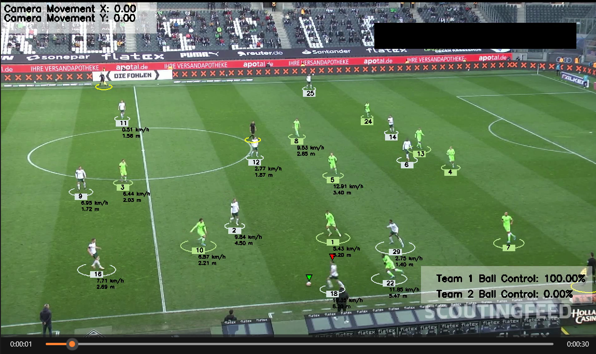

## Introduction

## Modules Used
The following modules are used in this project:
- YOLO: AI object detection model
- Kmeans: Pixel segmentation and clustering to detect t-shirt color
- Optical Flow: Measure camera movement
- Perspective Transformation: Represent scene depth and perspective
- Speed and distance calculation per player

## Sample video
-  [Sample input video](https://drive.google.com/file/d/1t6agoqggZKx6thamUuPAIdN_1zR9v9S_/view?usp=sharing)

## Requirements
To run this project, you need to have the following requirements installed:
- Python 3.x
- ultralytics
- supervision
- OpenCV
- NumPy
- Matplotlib
- Pandas
